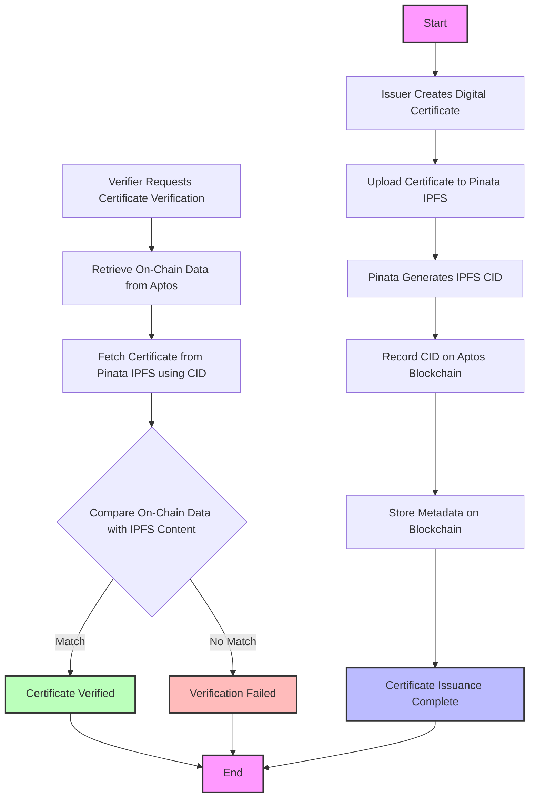

### CertifyZ

Certificate Verification dApp on Aptos with Pinata IPFS integration offers a cutting-edge solution for digital credentialing, combining the security and immutability of the Aptos blockchain with Pinata’s reliable, distributed IPFS storage. This decentralized application addresses the growing need for tamper-proof, easily verifiable digital certificates across various sectors, including education, professional development, and corporate credentialing. 

By utilizing blockchain technology, the dApp ensures the integrity and authenticity of digital certificates, while Pinata’s IPFS integration provides a scalable, cost-efficient method to store the actual certificate data off-chain. Authorized issuers can create digital certificates and upload them to Pinata’s IPFS. The resulting IPFS hash, along with metadata such as the recipient's address and timestamp, is recorded immutably on the Aptos blockchain. This creates a secure, permanent record of the certificate's existence and authenticity.

Verification becomes simple and efficient, allowing anyone to validate the certificate by cross-referencing the on-chain metadata with the certificate stored on Pinata's IPFS. This ensures the certificate’s authenticity while safeguarding data privacy and minimizing on-chain storage costs.

With its user-friendly interface and the speed of the Aptos blockchain, the dApp offers a seamless experience for both certificate issuers and verifiers. It has the potential to revolutionize secure, decentralized credential management, paving the way for a future where academic achievements, professional certifications, and other credentials are digitally stored and verified with ease.

Contract Address: 0x6607146e9769d897501d1a9fd108a1820dcb89be4541b71debab0e42bc863046    
Link:https://explorer.aptoslabs.com/txn/0x6607146e9769d897501d1a9fd108a1820dcb89be4541b71debab0e42bc863046?network=testnet

## System Flowchart



This flowchart illustrates the process of issuing and verifying certificates using our dApp, which integrates Aptos blockchain and Pinata IPFS.

## Getting Started

Install the necessary node modules by running npm install in terminal.

First, run the development server:

```bash
npm run dev
# or
yarn dev
# or
pnpm dev
# or
bun dev
```

Open [http://localhost:3000](http://localhost:3000) with your browser to see the result.

You can start editing the page by modifying `app/page.tsx`. The page auto-updates as you edit the file.

This project uses [`next/font`](https://nextjs.org/docs/app/building-your-application/optimizing/fonts) to automatically optimize and load [Geist](https://vercel.com/font), a new font family for Vercel.

## Made by Suparnojit Sarkar
